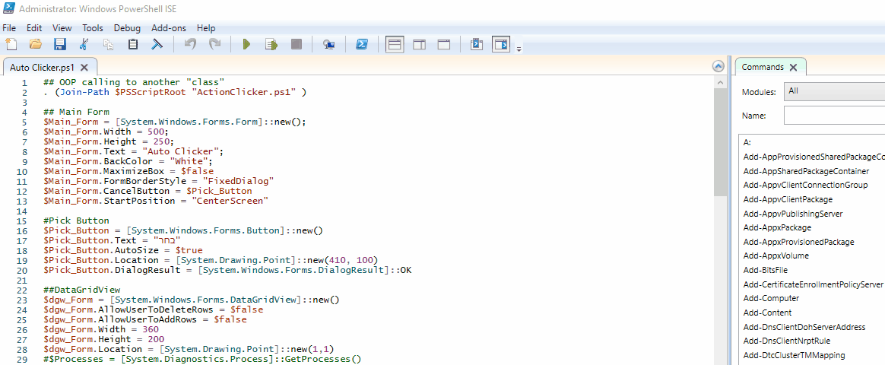

# Process Auto Clicker - תוכנה להשארת המחשב ער

תוכנת אוטומציה "Auto Click" פותחה על מנת לתת מענה לאנשים שרוצים להשאיר את המחשב שלהם דולק מבלי שיכנס למצב שינה \ נעילה. התוכנה אינה 100% וזקוקה לשיפורים.  התוכנה נועדה בעיקר כדי לתת דוגמה והשראה לאנשים איך לבנות מערכת אוטו קליקר בPowershell. 
 
התוכנה שואבת את רוב נתוניה בדומה לC# וניתנת לקמפול בעזרת תוכנות דחיסת קבצי הPS1 לקובץ EXE שרץ בסביבת C#. יש לזכור שהתוכנות מתבססות על אותו CLR שהוא הDOT NET. 
התוכנה נכתבה ללא שימוש בCMDLET כדי לצמצם את הפגיעה בפונקציונליות התוכנה וכדי לתת מענה מלא לכל הסביבות (בדומה לC#).
 
התוכנה שואבת באמצעות GetProcessByName() דרך הClass הידוע System.Diagnostics - לצורך הדוגמא בחרתי באפליקציית דפדפן הChrome ועל כן יש לשנות בהתאם. כמו כן, בדפדפן הדרך הטובה להשארת הפונקצונליות היא באמצעות Refresh או F% ולכן אם למשל התוכנה מתבססת את מקש שונה יש לשנות בהתאם בקובץ ActionClicker.PS1.
 
לאחר מכן התוכנה שופכת את המידע לתוך Grid View יעודי שנותן את הפרטים, התוכנה מתבססת על WindowMainHandler וכמו כן על Window Title. ברשימת הProcess ניתן לראות שלוש טבלאות לזיהוי, למשל בProcess של כרום נפתחים  בנוסף לדפדפן לפחות 8 נוספים שהם אינם או שצריך להשתלט עליהם ולכן חשוב לשים לב כמו בדוגמה היכן רשום הWindow Titlew שכן התוכנה שואבת ממנו את המידע.
 
נעשה שימוש בExpandProperty כדי לשאוב את המשתנים השונים כString ולאחר מכן לגשת אליהם תוך כדי אינדוקס (Index). לאחר לחיצה על "בחר" חלון חדש נפתח ומציג לכם את הפרטים על התהליך הפתוח שבחרצתם. חלון זה נועד בעיקר כדי לתת תשומת לב למשתמש האם הוא בחר נכון ושכל הפרטים נכונים בנוגע לתהליך שנבחר.
לאחר מכן ישנם שלושה כפתורים - הפעל, הפסק ויציאה. כשמם כן הם.
 
חשוב לשים לב, הדפדפן אמור להיות פתוח, והוא כבר יקפוץ לבד. התוכנה מתבססת על SendKeys וCrouserPosition לדימוי לחיצת מקלדת ותזוזת עכבר. 
כמו בדוגמה - האתר עושה רענון כל 5 שניות.
 
למיטוב ביצועים כל התהליך נכנס לתוך Start-Job שבעצם פותח "job in background" או בעברית "תהליך ברקע" אשר מייעל את הביצועים של התוכנה עצמה ואת התגובתיות. 
כפתור ההפסק סוגר את העבודה שנפתחה ומפסיק את הפעולות ולאחר מכן ניתן להמשיך הלאה מאיפה שנפסק.

דברים שצריכים לשנות -
 
בסקריפט "ActionClicker" יש לשים לב לSleep שהוא על 5000 - כלומר 5 שניות. החישוב הוא עליכם ;)
 
בסקריפט "ActionClicker" יש לשנות בהתאם את הSendKeys. יש באינטרנט רשימה מלאה של מיקרוסופט בנושא. 
 
בסקיפט "Auto Clicker" שהוא הראשי ומפעיל את האפליקציה - יש לשנות בGetProcessByName יש האפליקציה שרוצים לאתר. ניתן להחליף בGetProcess אשר יתן את כל התוצאות של כל התהליכים שכרגע רצים במחשב. זוהי אופציה טובה יותר לדעתי, שובהתכונה נועדהה להמחשה.

שלכם,
מתן ברהום!
לכל מענה ושאלה MatanBarhoum@outlook.com

