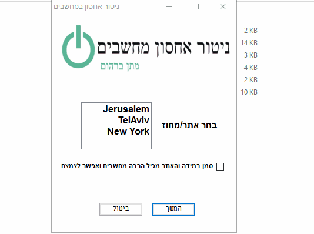

# ניטור אחסון במחשבים ארגוניים - אוטומציה - בעל ממשק משתמש

הדמיה:
  

  
תרם לי המון להרחבת הידע ביצירת ממשקי משתמשים בPowerShell והאינטגרציה שלהם עם הפקודות השונות שהשפה מציעה. בדוגמה הנוכחית (מיני רבות בבנייה כרגע) - המנהל רשתות דרוש לבחור אתר (SITE) שהוא בעצם יחידה ארגונית (Organizational Unit / OU) שנמצאת להם בAD. 

במידה והאתר מכיל אתרים בתוכו (למשל, אתר ירושלים מכיל בתוכו תתי אתרים כגון "דרך חברון", "תלפיות") יש לערוך את קובץ Resize להתאים לשמות של הOU שלכם בארגון.

יש לערוך בכל מקרה בMain.PS1 את שורה 28 ($Nitor_Sites = @('Jerusalem', 'TelAviv', 'New York')) שיתאים לאתרים שנמצאים לכם בAD. חשוב לציין - התוכנה מתבססת על ארגון שעובד בתשתית הבאה : 
1. לכל אתר ישנו OU נוסף בשם Computers (כמו כן Users, Group). כלומר, האלגוריתם מחפש עבור OU=Computers,OU=YOUR_CHOOSE ולכן יש לערוך בהתאם אם המחשבים שלכם פשוט נמצאים כאובייקט בOU הספציפי. 
2. כמו כן יש לשים לב שהתוכנה נבנתה על סביבה וירטואלית שמדמה ארגון ממשלתי gov.il ולכן יש לערוך בהתאם את הנתיבים לDC=Your First DC,DC=Your Seconds DC - למשל GOV.IL יהיה DC=gov,DC=il (כמו הגרסא הנוכחית).

התוכנה תעבור שדרוגים ותתעדכן בהתאם.
